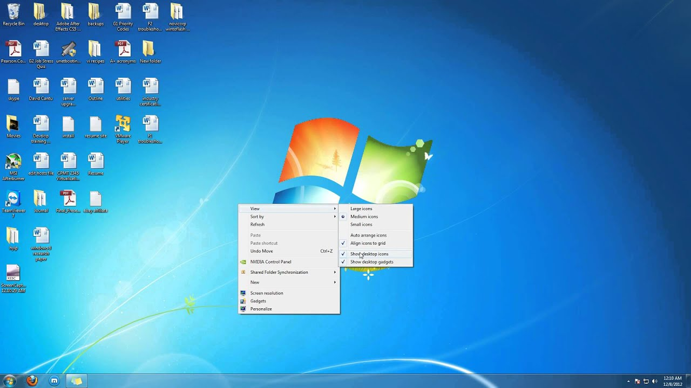
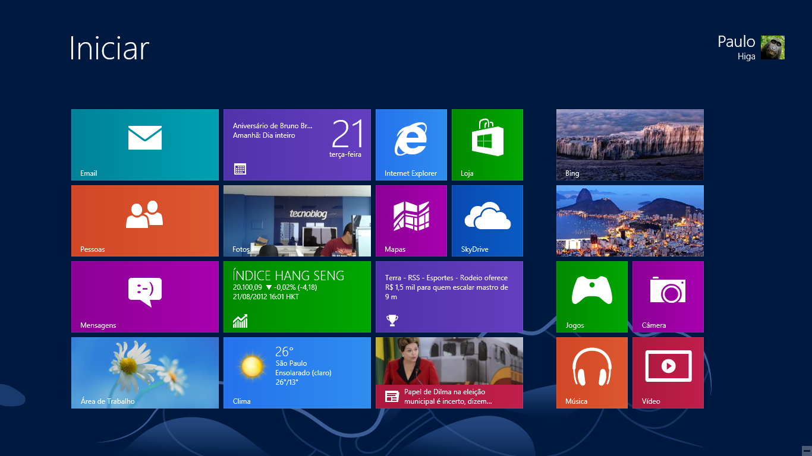
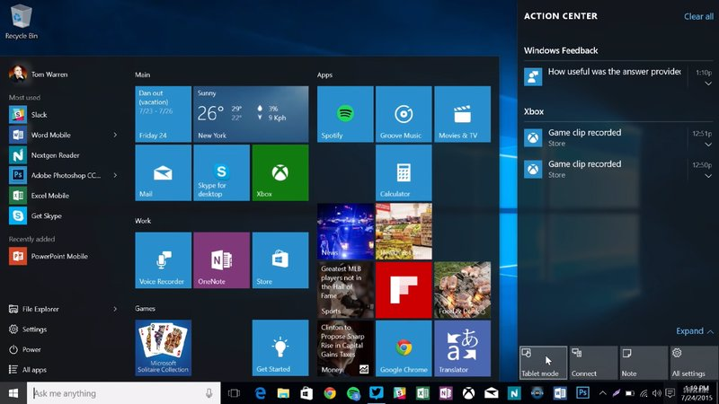
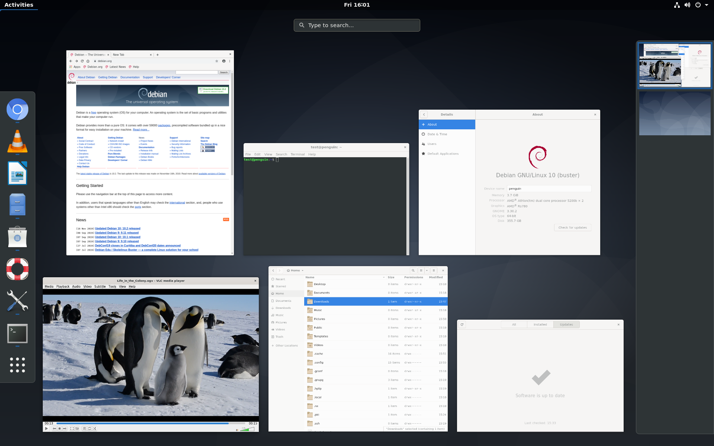
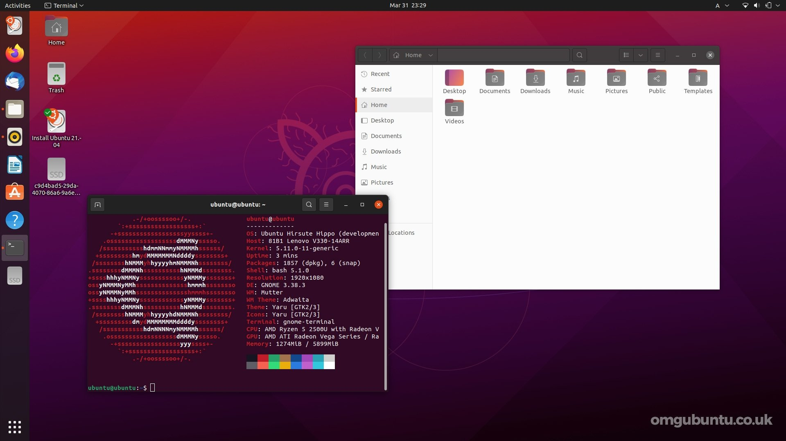
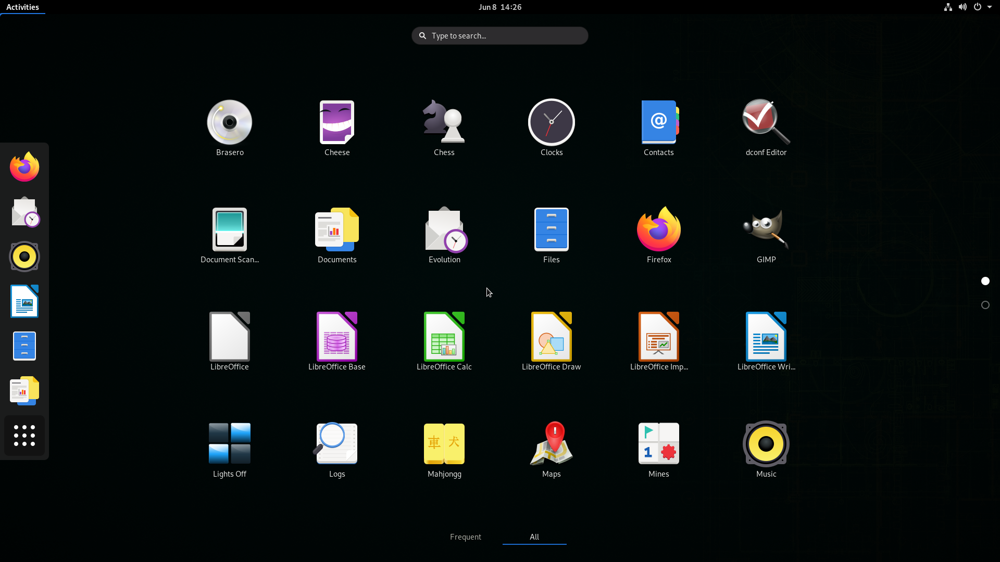
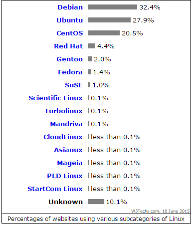

# Sistemas Operacionais

Os sistemas operacionais são softwares cuja função é administrar e gerenciar os recursos de um sistema, desde componentes de hardware e sistemas de arquivos a programas de terceiros, estabelecendo a interface entre o computador e o usuário.

Existem 2 tipos de sistemas operacionais, aqueles de **código aberto** e aqueles de **código fechado**.

O software de código fechado são os distribuídos com uma licença e não pode ser modificado ou adaptado pelo usuário.

Por outro lado, o software de código aberto é o oposto, pois pode ser modificado pelo usuário e é distribuído gratuitamente.

## Código Fechado 

### Windows

Como exemplo de código fechado temos o Windows, que é um sistema operacional de multitarefas para computadores e dispositivos móveis, desenvolvido pela Microsoft. A palavra Windows significa literalmente “janelas”, na tradução do inglês para o português.

Considerado um dos sistemas operacionais mais utilizados em todo o mundo, o Windows começou a ser projetado em 1981, mas foi apenas em 1993 que sua primeira versão foi lançada.

### Lista e histórico das principais versões do Windows:

 ### Windows 98
 
 #### Descrição e características
 O Microsoft Windows 98 era um sistema operacional produzido pela Microsoft que foi lançado em 25 de Junho de 1998, sendo o sucessor do Windows 95. A maior novidade desta versão era a completa integração do sistema operacional com a internet utilizando o Internet Explorer 4. Introduziu o sistema de arquivos FAT-32 e começou a introduzir o teletrabalho (só foi possível devido à integração do Web). Melhorou bastante a interface gráfica e incluiu o suporte a muitos monitores e ao USB. Mas, por ser maior do que o Windows 95 e possuir mais funções, era também mais lento e mais instável.

***

 ### Windows XP
 
 #### Descrição e características
O XP apresentou ainda a tecnologia ClearType, que facilitava a visualização de textos em tela LCD, novidades na época, e também  melhorou o consumo de energia para a utilização em dispositivos móveis como notebook e tablets, e incluiu a possibilidade de inicializar a máquina mais rapidamente e hibernar. Além disso, o que mais se observa foi o seu avanço gráfico em relação ao anterior.

***

 ### Windows 7
 
 #### Descrição e características
Diferente do Windows Vista, que introduziu um grande número de novas características, Windows 7 foi uma atualização mais modesta e focalizada para ser mais eficiente, limpo e mais prático de usar, com a intenção de torná-lo totalmente compatível com aplicações e hardwares com os quais o Windows Vista já era compatível.
Sua aparência foi modificada e foi introduzido uma interface mais "clean".

***

 ### Windows 8
 
 #### Descrição e características
O Windows 8 veio com uma proposta mais radical, mudar a interação do usuário com o sistema, através de várias inovações como:
- Uma nova interface gráfica
- Icones mais vivos
- Barra de “charms”
- Multitarefas.
- Redes sociais.
- Windows Store.
- Ligado na nuvem.

Pórem não foi muito bem aceito pelos usuários, tendo em vista o sucesso do seu antecessor, o windows 7 com a proposta de um sistema mais "simples".

***

### Windows 10
 
 #### Descrição e características
O Windows 10 trouxe em seu lançamento a ideia de se tornar uma plataforma unificada, isso significa que a Microsoft pretende que o Windows 10 seja utilizado em computadores, tablets, smartphones e outros aparelhos. Em seu lançamento, os principais pontos destacados foram:

- A volta do Menu Iniciar.
- Aplicativos em janelas.
- Múltiplas áreas de trabalho.
- Botão "Task View".
- Interfaces touchscreen.
- Design minimalista.

***

### Windows 11

 
 #### Descrição e características
O Windows 11 foi anunciado em junho de 2021 e passou alguns meses em fase de testes para alguns usuários. Isso terminou no dia 5 de outubro, quando a plataforma enfim foi disponibilizada para o público geral. Apesar disso, nem todos puderam atualizar o Windows logo no lançamento – o update foi distribuído aos poucos pela Microsoft.

As principais novidades que o novo sistema operacional trás são:

- Visual mais bonito e transparente.
- Nova loja de apps com Android.
- Segurança e velocidade.
- Sistema Snap Groups.
- Suporte multitelas.
- Atualização gratuita (para aqueles que desejam migrar do Windows 10).

***

## Código Aberto

### Distribuições Linux
Como exemplo de código aberto temos o Linux, que é um termo popularmente empregado para se referir a sistemas operacionais que utilizam o Kernel Linux. O kernel foi desenvolvido pelo programador finlandês Linus Torvalds, inspirado no sistema Minix. 

O desenvolvimento do Linux é considerado um dos exemplos mais proeminentes de colaboração de software de código aberto. O código-fonte pode ser usado, modificado e distribuído - com fins comerciais ou não - por qualquer um, respeitando as licenças, como a GNU General Public License versão 2, devolvendo o código desenvolvido de volta para o desenvolvimento do núcleo.

Devido a sua extrema popularidade por ser um OS de código aberto, o Linux se difundiu em inúmeras distribuições, fazendo que sua aplicação abranja uma grande gama de usuários, como por exemplo usuários domésticos, corporativos e até servidores.

### Lista e histórico das 5 principais distribuições do Linux:

### 1. Linux Mint

 

Linux Mint é uma distribuição feita para computadores desktop e laptop, ele foi criado com o propósito de funcionar "out of box", ou seja, funciona imediatamente após a instalação.
#### Descrição e características
Ela pode ser utilizada com vários ambientes de interface gráfica, porém sem dúvida a mais famosa é a Cinnamon (da foto acima), que possui design moderno, leve e elegante, muito semelhante ao Windows.
As principais novidades que o novo sistema operacional trás são:

***

### 2. Linux Debian

#### Descrição e características
O Debian, anteriormente chamado de Debian GNU/Linux, é um sistema operacional composto inteiramente a partir de softwares e programas livres, e mantido pelo Projeto Debian.
Ele é um sistema de uso geral, sendo possível utilizá-lo tanto no laptop e desktop quanto em servidores do mundo inteiro.
A interface gráfica padrão do Debian é o GNOME (como na foto acima), porém é possível utilizar qualquer ambiente desktop ou gerenciador de janelas que você preferir.

***

### 3. Linux Ubuntu

#### Descrição e características
Sendo uma das maiores distribuições Linux existentes no mundo, suas principais características são a facilidade e a acessibilidade, além na vasta quantidade de pacotes disponíveis, tornando-o um sistema completo.

***

### 4. OpenSUSE

#### Descrição e características
O openSUSE é um sistema operacional Linux que se destaca pela leveza e, ao mesmo tempo, gama de ferramentas avançadas. O sistema operacional traz de fábrica programas avançados para edição de textos, planilhas eletrônicas e edição de imagens, além do navegador Mozilla Firefox e outros aplicativos. No geral, o conjunto é mais do que suficiente para a maioria dos usuários.

***
### 5. Manjaro Linux

#### Descrição e características
Manjaro é uma distribuição orientada para desktop baseada em Arch Linux, ele possui um processo de instalação intuitivo e uma interface gráfica amigável para novos usuários, o Manjaro utiliza o Xfce, Gnome e KDE como principais opções de interface gráfica, e utiliza como gerenciador de pacotes padrão o PACMAN e PAMAC, sendo possível utilizar repositórios do AUR (Arch User Repository).

***

### Distribuições Linux mais utilizadas em servidores:

Na lista acima é possível notar que mesmo ocm a existência de distribuições focadas apenas para o uso em servidores, o Debian é o mais utilizado devido a sua estabilidade e documentação extensa voltada ao usuário o que faz a distro ideal para todos ambientes empresariais e também o fazendo favorito da maioria dos desenvolvedores.

***

### Distribuições Linux mais utilizada em computadores pessoais:

#### Ubuntu

Como uma das principais distribuições Linux, o Ubuntu é uma das distros mais utilizadas no quesito de computadores pessoais. Devido a sua segurança, estabilidade e por ser gratuito, ele se torna um dos favoritinhos para o uso doméstico. Sua interface amigável foi extremamente importante para a sua popularidade, já que como muitos usuários migram do Windows, sua interface recebe bem esses usuários.

